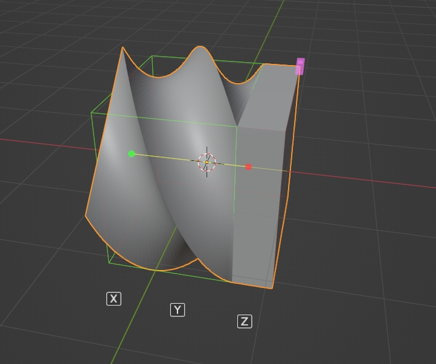

# SimpleDeformHelper

Simple Deform Modifier Visual adjustment tool

You can modify parameters more intuitively by dragging the gizmo directly

To display the gizmo, you need to select the active object and the active modifier is a simple deformation modifier

1. Angle control gizmo

You can drag to control the modifier's value

2. Axial control gizmo

Modify the deformation axis of the active modifier by clicking

Shortcut keys (when dragging the gizmo):

X Y Z: modify the modifier's deformation axis

A: Show deformation axis gizmo

Scroll wheel: switch the origin control mode

Toggle the axial gizmo (displayed only when the mode is bending):

6 directions, each direction has two directions that can be switched